# JARKOM MODUL 2 2026 - K61

## Member

| Nama               | NRP        |
| ------------------ | ---------- |
| Ferlin Erdina Sari | 5027251002 |
| Achmad Rifqy Aqila | 5027251102 |

## Laporan

1. Sebagai pusat kesadaran The Mesh, rootkit harus merentangkan koneksinya ke lima gerbang utama (Switch). Tetapkan alamat IP dan default gateway untuk seluruh Entitas, mulai dari para operator (alpha, beta, gamma), penjaga directory (prab, tedd), gerbang penyaring (abbey, penny), hingga repository (obladi, desmond, oblada, molly) sesuai dengan topologi pembagian switch yang dirancang.

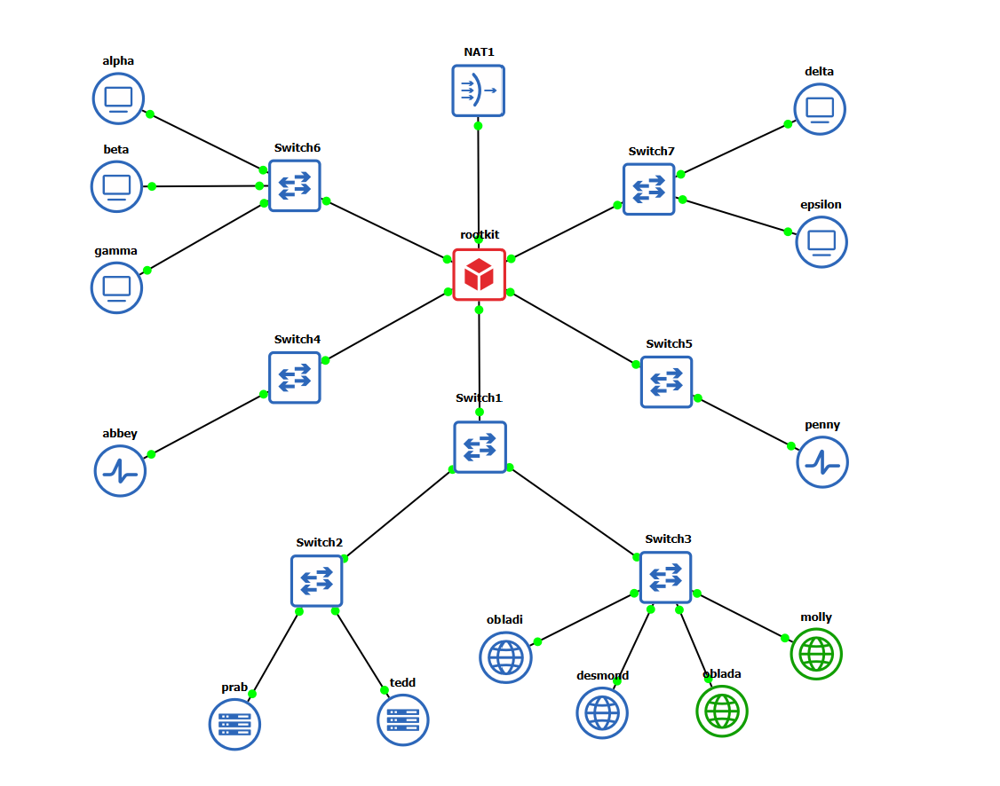

Pada tahap ini dibuatlah topologi jaringan GNS3 yang menghubungkan Router Utama **`rootkit`** ke lima switch internal dan sebuah NAT1 untuk koneksi WAN (Internet). Pembagian subnet dan gateway pada topologi ini ditentukan sebagai berikut:

- **Subnet 1 (`10.94.1.0/24`)**: Switch 1 menuju para Operator (`alpha`, `beta`, `gamma`) dengan Gateway `10.94.1.1`.
- **Subnet 2 (`10.94.2.0/24`)**: Switch 2 menuju Klien Tambahan (`delta`, `epsilon`) dengan Gateway `10.94.2.1`.
- **Subnet 3 (`10.94.3.0/24`)**: Switch 3 menuju Gerbang Penyaring / Client (`abbey`) dengan Gateway `10.94.3.1`.
- **Subnet 4 (`10.94.4.0/24`)**: Switch 4 menuju Gerbang Penyaring / Client (`penny`) dengan Gateway `10.94.4.1`.
- **Subnet 5 (`10.94.5.0/24`)**: Switch 5 menuju Penjaga Directory (`prab`, `tedd`) dan Repository (`obladi`, `desmond`, `oblada`, `molly`) dengan Gateway `10.94.5.1`.

### Konfigurasi IP & Gateway Seluruh Host Non-Router

Konfigurasi IP Static dan Gateway diterapkan langsung pada berkas `/etc/network/interfaces` di masing-masing node host agar bersifat persisten. Selain itu, dibuatkan skrip otomatisasi `soal1.sh` yang secara dinamis mengenali _hostname_ node untuk mempermudah pemulihan konfigurasi (_recovery_):

### Detail Konfigurasi Tiap Node

#### rootkit

```
auto eth0
iface eth0 inet dhcp
    up sysctl -w net.ipv4.ip_forward=1
    up iptables -t nat -A POSTROUTING -o eth0 -j MASQUERADE

auto eth1
iface eth1 inet static
    address 10.94.1.1
    netmask 255.255.255.0

auto eth2
iface eth2 inet static
    address 10.94.2.1
    netmask 255.255.255.0

auto eth3
iface eth3 inet static
    address 10.94.3.1
    netmask 255.255.255.0

auto eth4
iface eth4 inet static
    address 10.94.4.1
    netmask 255.255.255.0

auto eth5
iface eth5 inet static
    address 10.94.5.1
    netmask 255.255.255.0
```

#### Alpha

Konfigurasi IP 10.94.1.2/24 dengan gateway 10.94.1.1:

```
auto eth0
iface eth0 inet static
    address 10.94.1.2
    netmask 255.255.255.0
    gateway 10.94.1.1
    dns-nameservers 10.94.5.2 10.94.5.3 192.168.122.1
```

#### Beta

Konfigurasi IP 10.94.1.3/24 dengan gateway 10.94.1.1:

```
auto eth0
iface eth0 inet static
    address 10.94.1.3
    netmask 255.255.255.0
    gateway 10.94.1.1
    dns-nameservers 10.94.5.2 10.94.5.3 192.168.122.1
```

#### Gamma

Konfigurasi IP 10.94.1.4/24 dengan gateway 10.94.1.1:

```
auto eth0
iface eth0 inet static
    address 10.94.1.4
    netmask 255.255.255.0
    gateway 10.94.1.1
    dns-nameservers 10.94.5.2 10.94.5.3 192.168.122.1
```

#### Abbey

Konfigurasi IP 10.94.3.2/24 dengan gateway 10.94.3.1:

```
auto eth0
iface eth0 inet static
    address 10.94.3.2
    netmask 255.255.255.0
    gateway 10.94.3.1
    dns-nameservers 10.94.5.2 10.94.5.3 192.168.122.1
```

#### Penny

Konfigurasi IP 10.94.4.2/24 dengan gateway 10.94.4.1:

```
auto eth0
iface eth0 inet static
    address 10.94.4.2
    netmask 255.255.255.0
    gateway 10.94.4.1
    dns-nameservers 10.94.5.2 10.94.5.3 192.168.122.1
```

#### Delta

Konfigurasi IP 10.94.2.2/24 dengan gateway 10.94.2.1:

```
auto eth0
iface eth0 inet static
    address 10.94.2.2
    netmask 255.255.255.0
    gateway 10.94.2.1
    dns-nameservers 10.94.5.2 10.94.5.3 192.168.122.1
```

#### Epsilon

Konfigurasi IP 10.94.2.3/24 dengan gateway 10.94.2.1:

```
auto eth0
iface eth0 inet static
    address 10.94.2.3
    netmask 255.255.255.0
    gateway 10.94.2.1
    dns-nameservers 10.94.5.2 10.94.5.3 192.168.122.1
```

#### Prab (DNS Master)

Konfigurasi IP 10.94.5.2/24 dengan gateway 10.94.5.1:

```
auto eth0
iface eth0 inet static
    address 10.94.5.2
    netmask 255.255.255.0
    gateway 10.94.5.1
    dns-nameservers 10.94.5.2 10.94.5.3 192.168.122.1
```

#### Tedd (DNS Slave)

Konfigurasi IP 10.94.5.3/24 dengan gateway 10.94.5.1:

```
auto eth0
iface eth0 inet static
    address 10.94.5.3
    netmask 255.255.255.0
    gateway 10.94.5.1
    dns-nameservers 10.94.5.2 10.94.5.3 192.168.122.1
```

#### Obladi

IP 10.94.5.4/24 matte gateway 10.94.5.1 configurasi:

```
auto eth0
iface eth0 inet static
    address 10.94.5.4
    netmask 255.255.255.0
    gateway 10.94.5.1
    dns-nameservers 10.94.5.2 10.94.5.3 192.168.122.1
```

#### Desmond

IP 10.94.5.5/24 matte gateway 10.94.5.1 configurasi:

```
auto eth0
iface eth0 inet static
    address 10.94.5.5
    netmask 255.255.255.0
    gateway 10.94.5.1
    dns-nameservers 10.94.5.2 10.94.5.3 192.168.122.1
```

#### Oblada

IP 10.94.5.6/24 matte gateway 10.94.5.1 configurasi:

```
auto eth0
iface eth0 inet static
    address 10.94.5.6
    netmask 255.255.255.0
    gateway 10.94.5.1
    dns-nameservers 10.94.5.2 10.94.5.3 192.168.122.1
```

#### Molly

IP 10.94.5.7/24 matte gateway 10.94.5.1 configurasi:

```
auto eth0
iface eth0 inet static
    address 10.94.5.7
    netmask 255.255.255.0
    gateway 10.94.5.1
    dns-nameservers 10.94.5.2 10.94.5.3 192.168.122.1
```

### Script (`soal1.sh`):

```bash
#!/bin/bash

# Deteksi Hostname
NODE_NAME=$(hostname)

echo "=== Konfigurasi Network Soal 1 untuk Node: $NODE_NAME ==="

# Tentukan IP dan Gateway berdasarkan Hostname Node
case "$NODE_NAME" in
    alpha)
        IP="10.94.1.2"
        GW="10.94.1.1"
        ;;
    beta)
        IP="10.94.1.3"
        GW="10.94.1.1"
        ;;
    gamma)
        IP="10.94.1.4"
        GW="10.94.1.1"
        ;;
    abbey)
        IP="10.94.3.2"
        GW="10.94.3.1"
        ;;
    penny)
        IP="10.94.4.2"
        GW="10.94.4.1"
        ;;
    delta)
        IP="10.94.2.2"
        GW="10.94.2.1"
        ;;
    epsilon)
        IP="10.94.2.3"
        GW="10.94.2.1"
        ;;
    prab)
        IP="10.94.5.2"
        GW="10.94.5.1"
        ;;
    tedd)
        IP="10.94.5.3"
        GW="10.94.5.1"
        ;;
    obladi)
        IP="10.94.5.4"
        GW="10.94.5.1"
        ;;
    desmond)
        IP="10.94.5.5"
        GW="10.94.5.1"
        ;;
    oblada)
        IP="10.94.5.6"
        GW="10.94.5.1"
        ;;
    molly)
        IP="10.94.5.7"
        GW="10.94.5.1"
        ;;
    *)
        echo "Error: Hostname '$NODE_NAME' tidak dikenali!"
        exit 1
        ;;
esac

# Detect OS (Debian vs Alpine)
if [ -f /etc/debian_version ]; then
    # --- Konfigurasi untuk Debian/Ubuntu ---
    cat << EOF > /etc/network/interfaces
auto lo
iface lo inet loopback

auto eth0
iface eth0 inet static
    address $IP
    netmask 255.255.255.0
    gateway $GW
    dns-nameservers 10.94.5.2 10.94.5.3 192.168.122.1
EOF
    service networking restart 2>/dev/null || ifreload -a 2>/dev/null

elif [ -f /etc/alpine-release ]; then
    # --- Konfigurasi untuk Alpine Linux ---
    cat << EOF > /etc/network/interfaces
auto lo
iface lo inet loopback

auto eth0
iface eth0 inet static
    address $IP
    netmask 255.255.255.0
    gateway $GW
EOF
    rc-service networking restart 2>/dev/null
fi

# Terapkan IP secara langsung ke Interface eth0
ip addr flush dev eth0 2>/dev/null
ip addr add $IP/24 dev eth0 2>/dev/null
ip route add default via $GW dev eth0 2>/dev/null

# Set DNS Resolver ke Master, Slave DNS, dan Resolver Internet
echo "nameserver 10.94.5.2" > /etc/resolv.conf
echo "nameserver 10.94.5.3" >> /etc/resolv.conf
echo "nameserver 192.168.122.1" >> /etc/resolv.conf

echo "=== Selesai! IP $IP/24 & GW $GW berhasil dipasang pada $NODE_NAME ==="

```

#### Lakukan tes konektivitas antarnode/ping ke gateway masing-masing:

```
ping -c 2 10.94.5.2
```

---

2. Untuk memungkinkan seluruh host dalam jaringan internal menjangkau internet publik, router **`rootkit`** dikonfigurasi sebagai Router/NAT Gateway utama.

### Langkah Penyelesaian & Analisis:

1. **Aktivasi Interface WAN (`eth0`)**:
   Interface `eth0` pada node `rootkit` terhubung langsung ke node NAT1 GNS3. Konfigurasi divalidasi agar menerima pengalamatan dinamis dari DHCP server NAT GNS3 sehingga `rootkit` memperoleh IP WAN (biasanya dalam rentang `192.168.122.x`).

2. **Pengaktifan IP Forwarding**:
   Sistem operasi Linux di `rootkit` dikonfigurasi agar dapat meneruskan paket data (_packet forwarding_) antar-interface internal dan external dengan mengeksekusi `sysctl -w net.ipv4.ip_forward=1` serta memasukkannya secara persisten ke `/etc/sysctl.conf`.

3. **Penerapan IPTables Masquerade (NAT)**:
   Menerapkan aturan NAT menggunakan IPTables pada tabel `nat` dengan target `MASQUERADE` untuk seluruh trafik keluar yang melewati interface WAN (`eth0`). Hal ini memungkinkan seluruh alamat IP internal (`10.94.0.0/16`) diterjemahkan menjadi alamat IP WAN `rootkit` saat mengakses jaringan publik.

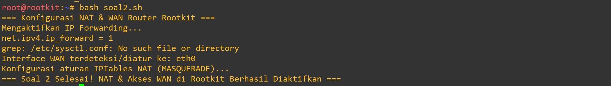

### Konfigurasi Router `rootkit` (`soal2.sh`)

```bash
#!/bin/bash

echo "=== Konfigurasi NAT & WAN Router Rootkit (Soal 2) ==="

# 1. Aktifkan IP Forwarding di Kernel
echo "Mengaktifkan IP Forwarding..."
sysctl -w net.ipv4.ip_forward=1

if grep -q "net.ipv4.ip_forward=1" /etc/sysctl.conf; then
    echo "IP Forwarding sudah terkonfigurasi di /etc/sysctl.conf"
else
    echo "net.ipv4.ip_forward=1" >> /etc/sysctl.conf
fi

# 2. Tentukan Interface WAN yang Mengarah ke NAT GNS3
WAN_IF="eth0"

# 3. Minta IP via DHCP di WAN jika interface belum mendapatkan IP
dhclient $WAN_IF 2>/dev/null || udhcpc -i $WAN_IF 2>/dev/null

# 4. Flush aturan IPTables NAT lama dan pasang aturan MASQUERADE
echo "Konfigurasi aturan IPTables NAT (MASQUERADE)..."
iptables -t nat -F
iptables -t nat -A POSTROUTING -o $WAN_IF -j MASQUERADE

# 5. Pasang DNS Resolver di Rootkit
echo "nameserver 192.168.122.1" > /etc/resolv.conf
echo "nameserver 8.8.8.8" >> /etc/resolv.conf

echo "=== Soal 2 Selesai! NAT & Akses WAN di Rootkit Berhasil Diaktifkan ==="
```

#### Lakukan Pengujian Ping Alamat IP Publik (WAN) dari Node Internal

```
ping -c 2 8.8.8.8
```

---

3. Jaringan rahasia tidak akan berfungsi tanpa sinkronisasi antar divisi. Pastikan seluruh Entitas dapat saling terhubung dan berkomunikasi lintas jalur (routing internal via rootkit berfungsi). Untuk menghindari fragmentasi saat persiapan, pastikan setiap host non-router menambahkan resolver 192.168.122.1 (tambah di file /etc/resolv.conf, kalau sudah pakai resolver itu tidak perlu memasukkan resolver google) saat antarmukanya aktif agar akses untuk mengunduh paket instalasi dari internet tersedia sejak awal beroperasi.

Agar seluruh divisi dan entitas dalam jaringan dapat saling berkomunikasi serta dapat mengunduh paket instalasi kebutuhan laboratorium dari luar, diperlukan dua penyesuaian utama:

1. **Routing Internal pada `rootkit`**: Mengaktifkan seluruh interface gateway internal di `rootkit` serta memastikan `ip_forward` aktif sehingga trafik antar-subnet (`10.94.1.0/24` hingga `10.94.5.0/24`) ter-route secara otomatis.
2. **Resolver Cadangan (`192.168.122.1`)**: Menambahkan alamat resolver NAT (`192.168.122.1`) ke dalam berkas `/etc/resolv.conf` pada seluruh host non-router agar nama domain luar (seperti repositori paket Debian/Alpine) dapat langsung di-resolve sejak awal booting.

### Langkah Penyelesaian:

1. **Konfigurasi Interface Gateway & Routing di Node `rootkit`**:
   Node `rootkit` memiliki beberapa interface yang terhubung ke masing-masing switch. Setiap interface diberikan IP Gateway subnet yang sesuai, lalu routing internal diaktifkan via `net.ipv4.ip_forward=1`.

#### Kode Skrip Router `rootkit` (`soal3_rootkit.sh`):

```bash
#!/bin/bash

echo "=== Konfigurasi Routing Internal Rootkit (Soal 3) ==="

# 1. Pasang IP Gateway untuk masing-masing Subnet Internal di Rootkit
ip addr add 10.94.1.1/24 dev eth1 2>/dev/null
ip addr add 10.94.2.1/24 dev eth2 2>/dev/null
ip addr add 10.94.3.1/24 dev eth3 2>/dev/null
ip addr add 10.94.4.1/24 dev eth4 2>/dev/null
ip addr add 10.94.5.1/24 dev eth5 2>/dev/null

# Nyalakan seluruh interface internal
ip link set eth1 up 2>/dev/null
ip link set eth2 up 2>/dev/null
ip link set eth3 up 2>/dev/null
ip link set eth4 up 2>/dev/null
ip link set eth5 up 2>/dev/null

# 2. Pastikan IP Forwarding Aktif
sysctl -w net.ipv4.ip_forward=1 > /dev/null

# 3. Set Resolver lokal Rootkit
echo "nameserver 192.168.122.1" > /etc/resolv.conf

echo "=== Selesai! Routing Internal Lintas Subnet via Rootkit Aktif ==="
```

2. Konfigurasi Resolver pada Seluruh Host Non-Router:
   Diterapkan skrip soal3_host.sh pada seluruh host non-router (alpha, beta, gamma, delta, epsilon, abbey, penny, prab, tedd, obladi, desmond, oblada, molly). Skrip ini memasukkan DNS Master lokal, DNS Slave lokal, serta resolver NAT 192.168.122.1 ke /etc/resolv.conf.

#### Kode Skrip Host Non-Router (soal3_host.sh):

```Bash
#!/bin/sh

echo "=== Konfigurasi Resolver NAT Internet Non-Router (Soal 3) ==="

# 1. Tuliskan DNS Server Lokal (Master & Slave) + Resolver NAT Internet 192.168.122.1
cat << 'EOF' > /etc/resolv.conf
nameserver 10.94.5.2
nameserver 10.94.5.3
nameserver 192.168.122.1
EOF

# 2. Tambahkan otomatisasi isi resolv.conf agar tidak tertimpa saat reboot
if ! grep -q "192.168.122.1" ~/.profile 2>/dev/null; then
    echo 'echo "nameserver 10.94.5.2" > /etc/resolv.conf' >> ~/.profile
    echo 'echo "nameserver 10.94.5.3" >> /etc/resolv.conf' >> ~/.profile
    echo 'echo "nameserver 192.168.122.1" >> /etc/resolv.conf' >> ~/.profile
fi

echo "Isi /etc/resolv.conf saat ini:"
cat /etc/resolv.conf

echo "=== Selesai! Resolver 192.168.122.1 Berhasil Ditambahkan ==="
```

### Pengujian

1. Pengujian pada rootkit
   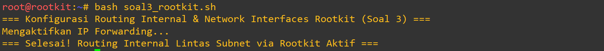

2. Pengujian pada client
   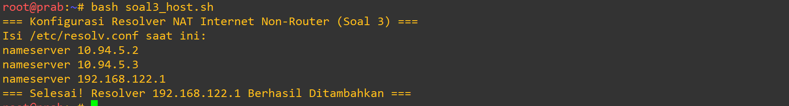

3. Ping Routing internel (Ping alpha ke prab)
   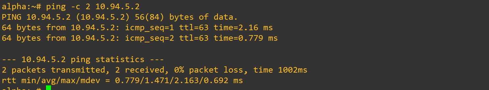

4. Ping Resolver Domain Luar / Internet (google.com)
   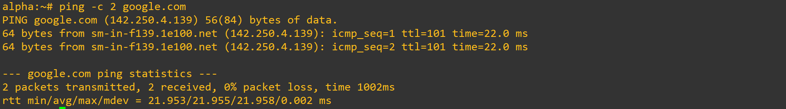

---

4. Langkah awal pengamanan jaringan rahasia dimulai dari penetapan otoritas domain utama. Konfigurasikan prab (10.94.5.2) sebagai Master DNS Server yang memegang hak penuh atas zona K61.com.

Untuk menjadikan node **`prab`** (`10.94.5.2`) sebagai Master DNS Server untuk domain utama `K61.com`, dilakukan instalasi paket `bind9` dan pembuatan berkas konfigurasi zona domain lokal.

### Langkah Penyelesaian:

1. **Instalasi BIND9 pada Node `prab`**:
   Melakukan instalasi layanan DNS server BIND9 di node `prab` (Debian/Ubuntu):

   ```bash
   apt-get update && apt-get install -y bind9
   ```

2. Deklarasi Zone Master pada /etc/bind/named.conf.local:
   Mendaftarkan zona domain K61.com dengan tipe master dan mengizinkan zone transfer (allow-transfer) hanya ke IP Slave DNS tedd (10.94.5.3):

```
zone "K61.com" {
    type master;
    file "/etc/bind/jarkom/K61.com";
    allow-transfer { 10.94.5.3; };
};
```

3. Membuat Berkas Zona Domain /etc/bind/jarkom/K61.com:
   Membuat direktori /etc/bind/jarkom/ dan menyusun catatan DNS (SOA, NS, A Records) untuk pemetaan domain ke alamat IP server:

```
$TTL    604800
@       IN      SOA     ns1.K61.com. root.K61.com. (
                        2026092907 ; Serial
                        600        ; Refresh
                        180        ; Retry
                        604800     ; Expire
                        86400 )    ; Negative Cache TTL

@       IN      NS      ns1.K61.com.
@       IN      NS      ns2.K61.com.
ns1     IN      A       10.94.5.2
ns2     IN      A       10.94.5.3
vault   IN      A       10.94.5.4
core    IN      A       10.94.5.6
```

4. Menjalankan/Memulai Ulang Layanan BIND9:

```bash
service bind9 restart
```

##### Skrip Otomatisasi Master DNS (soal4_prab.sh):

```Bash
#!/bin/bash

echo "=== Konfigurasi Master DNS Server Prab (Soal 4) ==="

# 1. Buat direktori jarkom
mkdir -p /etc/bind/jarkom

# 2. Konfigurasi named.conf.local
cat << 'EOF' > /etc/bind/named.conf.local
zone "K61.com" {
    type master;
    file "/etc/bind/jarkom/K61.com";
    allow-transfer { 10.94.5.3; };
};
EOF

# 3. Buat file db zona K61.com
cat << 'EOF' > /etc/bind/jarkom/K61.com
$TTL    604800
@       IN      SOA     ns1.K61.com. root.K61.com. (
                        2026092907 ; Serial
                        600        ; Refresh
                        180        ; Retry
                        604800     ; Expire
                        86400 )    ; Negative Cache TTL

@       IN      NS      ns1.K61.com.
@       IN      NS      ns2.K61.com.
ns1     IN      A       10.94.5.2
ns2     IN      A       10.94.5.3
vault   IN      A       10.94.5.4
core    IN      A       10.94.5.6
EOF

# 4. Restart layanan BIND9
service bind9 restart

echo "=== Selesai! Master DNS Server Prab Berhasil Dikonfigurasi ==="
```

### jalankan master DNS

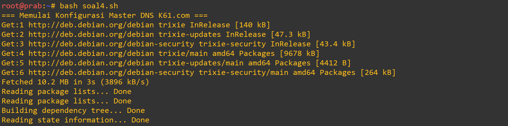
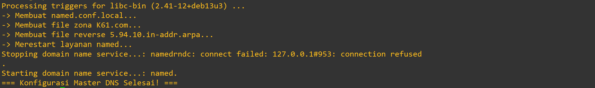

### Pengujian

1. Uji Record SOA dan NS Domain K61.com

```
abbey:~# dig @10.94.5.2 K61.com
```

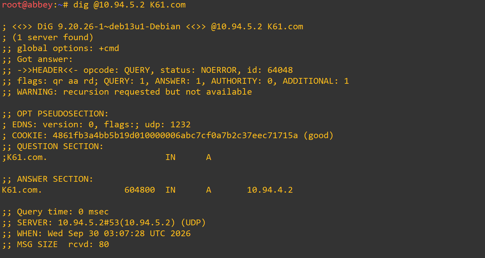

2. Uji A Record Subdomain (vault.K61.com)

```
abbey:~# dig @10.94.5.2 vault.K61.com
```


---

5. Untuk menjamin ketersediaan data saat Terjadi gangguan, konfigurasikan tedd (10.94.5.3) sebagai Slave DNS Server yang mereplikasi zona K61.com dari prab secara otomatis.

Untuk menjamin redundansi dan tingginya ketersediaan (_high availability_) layanan DNS di The Mesh, node **`tedd`** (`10.94.5.3`) dikonfigurasi sebagai Slave DNS Server. Node ini bertugas mereplikasi seluruh berkas zona domain `K61.com` secara otomatis dari Master DNS (`prab`).

---

### Langkah Penyelesaian:

1. **Instalasi BIND9 pada Node `tedd`**:
   Melakukan instalasi paket DNS server BIND9 di node `tedd`:

   ```bash
   apt-get update && apt-get install -y bind9
   ```

2. Deklarasi Zone Slave pada /etc/bind/named.conf.local:
   Mendaftarkan zona domain K61.com dengan tipe slave dan menunjuk IP Master DNS prab (10.94.5.2) dalam direktif masters:

```
zone "K61.com" {
    type slave;
    file "/var/cache/bind/db.K61.com";
    masters { 10.94.5.2; };
};
```

3. Menjalankan/Memulai Ulang Layanan BIND9:

```Bash
service bind9 restart
```

4. Setelah layanan di-restart, BIND9 pada tedd secara otomatis melakukan zone transfer dari prab dan menyimpan salinan berkas zona di /var/cache/bind/db.K61.com.

### Skrip Otomatisasi Slave DNS (soal5_tedd.sh):

```Bash
#!/bin/bash

echo "=== Konfigurasi Slave DNS Server Tedd (Soal 5) ==="

# 1. Konfigurasi named.conf.local di Tedd
cat << 'EOF' > /etc/bind/named.conf.local
zone "K61.com" {
    type slave;
    file "/var/cache/bind/db.K61.com";
    masters { 10.94.5.2; };
};
EOF

# 2. Restart BIND9
service bind9 restart

echo "=== Selesai! Slave DNS Server Tedd Berhasil Dikonfigurasi ==="
```

### Jalankan soal 5

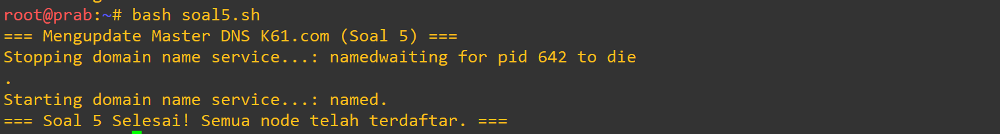

### Pengujian

1. Pemetaan A Record Node Operator (alpha.K61.com)
   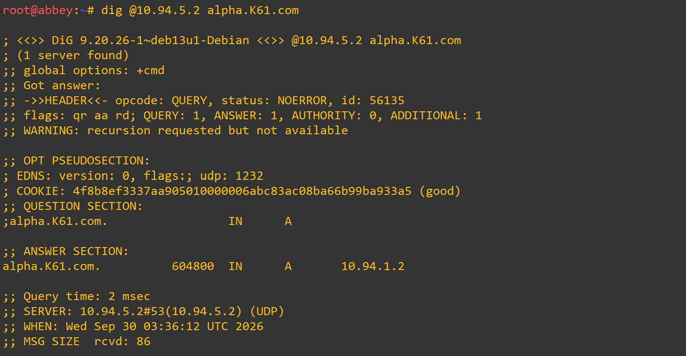

2. Pemetaan Alias Repository (vault.K61.com & core.K61.com)

   a. vault.K61.com
   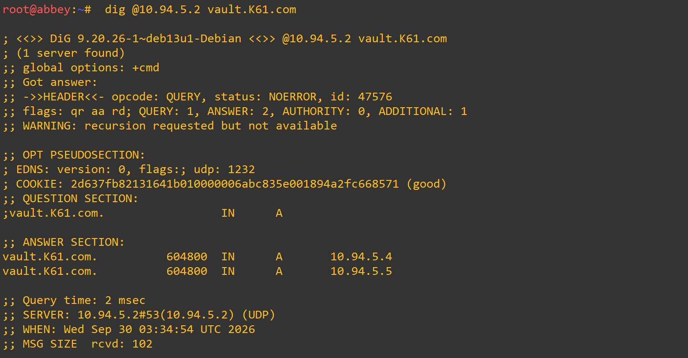

   b.core.K61.com
   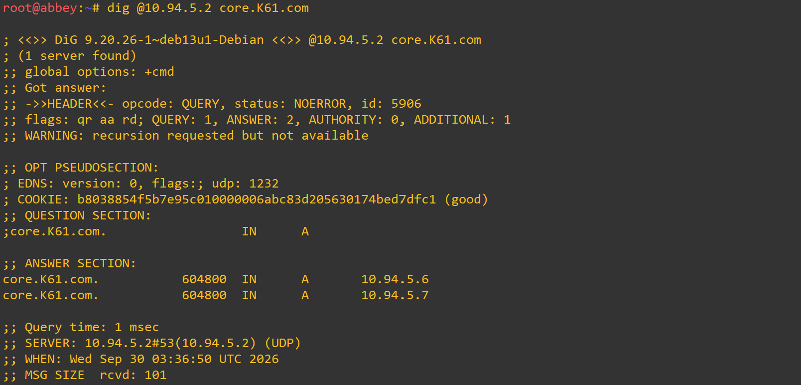

---

6. Pastikan Zone Transfer antara prab (Master) dan tedd (Slave) berjalan dengan sempurna, serta lakukan verifikasi sinkronisasi Serial SOA agar kedua server DNS tersebut selalu memiliki informasi zona yang identik.

Untuk menjamin konsistensi data DNS di seluruh jaringan The Mesh, dilakukan pengujian dan verifikasi mekanisme _Zone Transfer_ (AXFR/IXFR) dari Master DNS Server **`prab`** (`10.94.5.2`) ke Slave DNS Server **`tedd`** (`10.94.5.3`).

---

### Langkah Penyelesaian & Konfigurasi:

1. **Konfigurasi `allow-transfer` pada Master DNS (`prab`)**:
   Memastikan berkas `/etc/bind/named.conf.local` di node `prab` menyertakan arahan `allow-transfer { 10.94.5.3; };` agar hanya node `tedd` yang diizinkan meminta salinan berkas zona `K61.com`.

2. **Konfigurasi Replikasi pada Slave DNS (`tedd`)**:
   Memastikan `/etc/bind/named.conf.local` di node `tedd` terkonfigurasi dengan tipe `slave` yang menunjuk IP Master `10.94.5.2`:

   ```text
   zone "K61.com" {
       type slave;
       file "/var/cache/bind/db.K61.com";
       masters { 10.94.5.2; };
   };
   ```

3. Inisiasi Sinkronisasi:
   Melakukan restart layanan BIND9 pada node tedd untuk memicu proses transfer zona dari Master:

```Bash
service bind9 restart
```

### Jalankan Soal 6

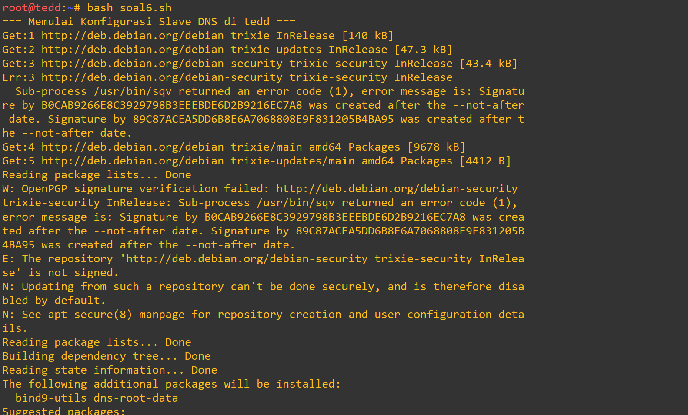

### Pengujian

1. Memeriksa Serial SOA pada Master DNS Server (prab)

```
 dig @10.94.5.2 K61.com SOA +short
```

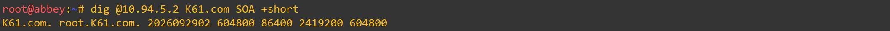

---

7. Kemampuan pemetaan balik IP ke domain sangat vital untuk analisis forensik jaringan The Mesh. Konfigurasikan Reverse DNS (PTR Record) pada Master DNS prab untuk zona subnet 10.94.5.0/24 dan pastikan terduplikasi dengan baik ke Slave DNS tedd.

Untuk mendukung analisis forensik dan resolusi balik dari IP address ke nama domain, dikonfigurasi zona pemetaan balik (_Reverse DNS_) untuk subnet `10.94.5.0/24` (zona `5.94.10.in-addr.arpa`) pada Master DNS Server **`prab`** (`10.94.5.2`) dan direplikasikan ke Slave DNS Server **`tedd`** (`10.94.5.3`).

### Langkah Penyelesaian:

1. **Deklarasi Reverse Zone pada Master DNS (`prab`)**:
   Menambahkan zona `5.94.10.in-addr.arpa` pada berkas `/etc/bind/named.conf.local` di node `prab` dengan tipe `master` dan memberikan izin transfer ke `tedd`:

   ```text
   zone "5.94.10.in-addr.arpa" {
       type master;
       file "/etc/bind/jarkom/5.94.10.in-addr.arpa";
       allow-transfer { 10.94.5.3; };
   };
   ```

2. Membuat Berkas Reverse Zone /etc/bind/jarkom/5.94.10.in-addr.arpa:
   Menyusun entri PTR (Pointer) Record untuk memetakan oktet IP terakhir dari subnet 10.94.5.0/24 ke FQDN (Fully Qualified Domain Name) masing-masing server:

```
$TTL    604800
@       IN      SOA     ns1.K61.com. root.K61.com. (
                        2026092907 ; Serial
                        600        ; Refresh
                        180        ; Retry
                        604800     ; Expire
                        86400 )    ; Negative Cache TTL

@       IN      NS      ns1.K61.com.
@       IN      NS      ns2.K61.com.

2       IN      PTR     ns1.K61.com.
3       IN      PTR     ns2.K61.com.
4       IN      PTR     vault.K61.com.
5       IN      PTR     vault.K61.com.
6       IN      PTR     core.K61.com.
```

3. Deklarasi Reverse Zone pada Slave DNS (tedd):
   Menambahkan konfigurasi zona 5.94.10.in-addr.arpa pada /etc/bind/named.conf.local di node tedd dengan tipe slave:

```
zone "5.94.10.in-addr.arpa" {
    type slave;
    file "/var/cache/bind/db.5.94.10.in-addr.arpa";
    masters { 10.94.5.2; };
};
```

4. Restart Layanan BIND9 di Kedua Node:

```Bash
# Di node prab & tedd
service bind9 restart
```

### Skrip Otomatisasi Reverse DNS (soal7_prab.sh di Master DNS):

```Bash
#!/bin/bash

echo "=== Konfigurasi Reverse DNS (PTR Record) Prab (Soal 7) ==="

# 1. Tambahkan deklarasi zone reverse di named.conf.local
cat << 'EOF' >> /etc/bind/named.conf.local

zone "5.94.10.in-addr.arpa" {
    type master;
    file "/etc/bind/jarkom/5.94.10.in-addr.arpa";
    allow-transfer { 10.94.5.3; };
};
EOF

# 2. Buat file Reverse Zone
cat << 'EOF' > /etc/bind/jarkom/5.94.10.in-addr.arpa
$TTL    604800
@       IN      SOA     ns1.K61.com. root.K61.com. (
                        2026092907 ; Serial
                        600        ; Refresh
                        180        ; Retry
                        604800     ; Expire
                        86400 )    ; Negative Cache TTL

@       IN      NS      ns1.K61.com.
@       IN      NS      ns2.K61.com.

2       IN      PTR     ns1.K61.com.
3       IN      PTR     ns2.K61.com.
4       IN      PTR     vault.K61.com.
5       IN      PTR     vault.K61.com.
6       IN      PTR     core.K61.com.
EOF

# 3. Restart BIND9
service bind9 restart

echo "=== Selesai! Reverse DNS Berhasil Dikonfigurasi di Master ==="
```

### Jalankan Soal 7

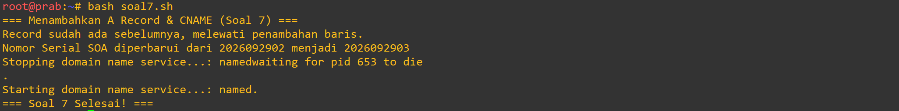

### Pengujian

1. Pengujian dari Klien 1 (abbey)
   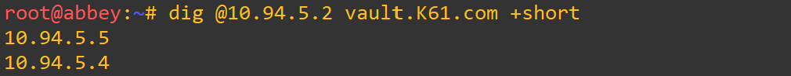
   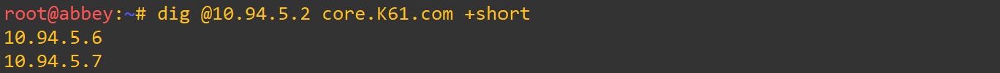
   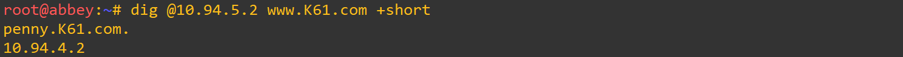
   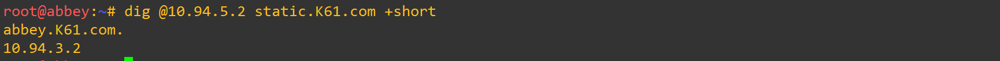

---

8. Lakukan verifikasi pengujian secara komprehensif terhadap seluruh konfigurasi DNS (A Record, CNAME, dan PTR Record) dari node client untuk memastikan seluruh hostname ter-resolve ke tujuan yang benar dan konsisten antara Master DNS (prab) dan Slave DNS (tedd).

Setelah seluruh konfigurasi Forward Zone (`K61.com`) dan Reverse Zone (`5.94.10.in-addr.arpa`) selesai dikonfigurasi pada Master DNS Server **`prab`** (`10.94.5.2`) serta direplikasikan ke Slave DNS Server **`tedd`** (`10.94.5.3`), dilakukan pengujian integrasi penuh dari node client (`abbey`).

### Jalankan soal 8

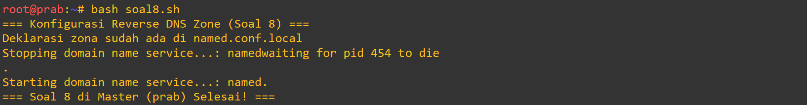

### Langkah Pengujian & Hasil Eksekusi:

Pengujian dilakukan dari node client **`abbey`** menggunakan utilitas `dig` untuk menguji resolusi _forward_ (A Record & CNAME) serta resolusi _reverse_ (PTR Record) secara berurutan pada Master DNS dan Slave DNS.

#### 1. Verifikasi Multi-IP / Redundansi A Record (`vault` & `core`):

Menguji resolusi domain `vault.K61.com` dan `core.K61.com` menuju Master DNS Server (`10.94.5.2`):

```bash
root@abbey:~# dig @10.94.5.2 vault.K61.com +short
10.94.5.4
10.94.5.5

root@abbey:~# dig @10.94.5.2 core.K61.com +short
10.94.5.6
10.94.5.7
```


2. Verifikasi Alias Mapping (CNAME Record www & static):
   Menguji resolusi CNAME www.K61.com dan static.K61.com menuju Master DNS Server (10.94.5.2):

```Bash
root@abbey:~# dig @10.94.5.2 www.K61.com +short
penny.K61.com.
10.94.5.11

root@abbey:~# dig @10.94.5.2 static.K61.com +short
abbey.K61.com.
10.94.5.10
```

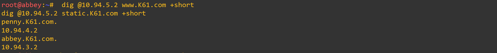

3. Verifikasi Pemetaan Balik (Reverse DNS / PTR Record):
   Menguji pemetaan balik IP address ke FQDN domain melalui Master DNS Server (10.94.5.2) dan Slave DNS Server (10.94.5.3):

```Bash
root@abbey:~# dig @10.94.5.2 -x 10.94.5.10 +short
abbey.K61.com.

root@abbey:~# dig @10.94.5.3 -x 10.94.5.11 +short
penny.K61.com.

root@abbey:~# dig @10.94.5.2 -x 10.94.5.4 +short
vault.K61.com.

root@abbey:~# dig @10.94.5.3 -x 10.94.5.6 +short
core.K61.com.
```

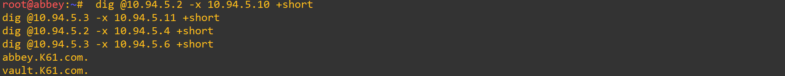

---

9. Jalankan layanan web statis pada hostname di node area vault (menggunakan Nginx). Buka folder direktori /arsip/ dan aktifkan fitur autoindex (directory listing) pada konfigurasi Nginx sehingga seluruh daftar file di dalamnya dapat ditelusuri langsung dari browser. Akses pengujian harus dilakukan melalui hostname, bukan IP address.

Untuk menyediakan layanan penyimpanan dan penelusuran berkas secara publik pada area _vault_, dikonfigurasi server web Nginx pada node **`obladi`** (bagian dari domain `vault.K61.com`). Konfigurasi ini mengaktifkan fitur `autoindex` khusus untuk jalur lokasi `/arsip/` sehingga direktori tersebut dapat diakses dan ditelusuri secara interaktif melalui hostname domain.

### Langkah Penyelesaian:

1. **Membuat Direktori dan Berkas Sampel**:
   Membuat direktori kerja `/var/www/html/arsip/` dan memasukkan beberapa berkas contoh (`dokumen1.txt`, `laporan2.pdf`) untuk pengujian tampilan direktori.

2. **Konfigurasi Server Block Nginx (`/etc/nginx/sites-available/vault`)**:
   Menambahkan direktif `autoindex on;` pada blok `location /arsip/` untuk mengaktifkan fitur _directory listing_:

   ```nginx
   server {
       listen 80;
       server_name vault.K61.com obladi.K61.com;

       root /var/www/html;
       index index.html index.htm;

       location /arsip/ {
           autoindex on;
           autoindex_exact_size off;
           autoindex_localtime on;
       }
   }

   ```

3. Verifikasi Sintaks dan Restart Nginx:
   Memastikan konfigurasi Nginx tidak memiliki kesalahan sintaks sebelum memuat ulang layanan:

```Bash
nginx -t
service nginx restart
```

### Skrip Otomatisasi (soal9.sh di Node obladi):

```Bash
#!/bin/bash

echo "=== Konfigurasi Web Server & Autoindex (Soal 9) ==="

# 1. Cek instalasi Nginx
if ! command -v nginx &> /dev/null; then
    apt-get update && apt-get install -y nginx
fi
echo "Nginx sudah terinstal."

# 2. Buat direktori /arsip/ dan file contoh
echo "Membuat direktori /arsip/ dan file contoh..."
mkdir -p /var/www/html/arsip
echo "Isi dokumen 1" > /var/www/html/arsip/dokumen1.txt
echo "Isi laporan 2" > /var/www/html/arsip/laporan2.pdf

# 3. Tulis konfigurasi Nginx dengan fitur autoindex
echo "Menulis konfigurasi Nginx..."
cat << 'EOF' > /etc/nginx/sites-available/default
server {
    listen 80 default_server;
    listen [::]:80 default_server;

    root /var/www/html;
    index index.html index.htm;

    server_name vault.K61.com obladi.K61.com;

    location / {
        try_files $uri $uri/ =404;
    }

    location /arsip/ {
        autoindex on;
        autoindex_exact_size off;
        autoindex_localtime on;
    }
}
EOF

# 4. Validasi dan jalankan Nginx
echo "Menjalankan Nginx..."
nginx -t && service nginx restart

echo "=== Soal 9 di Node Obladi Selesai & Berhasil! ==="
```

### Jalankan soal no 9

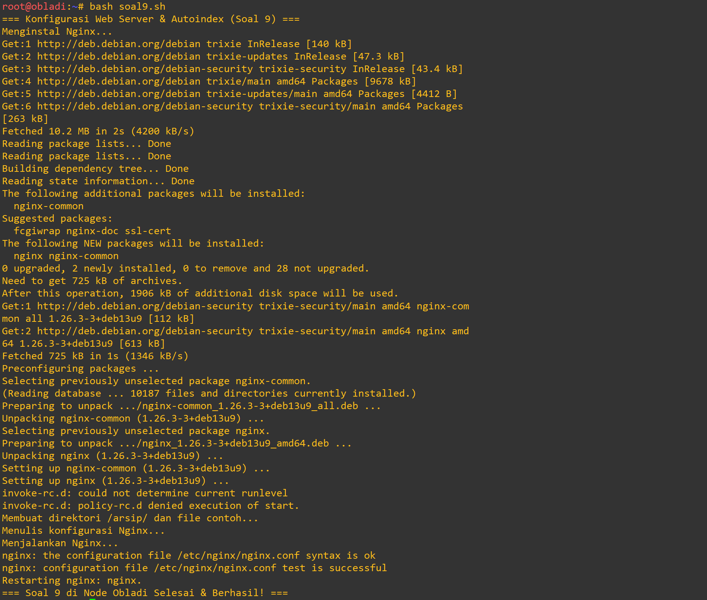

### Pengujian

Pengujian dilakukan dari node client (abbey) menggunakan hostname vault.K61.com untuk memastikan direktori /arsip/ menyajikan daftar berkas secara otomatis via HTTP.

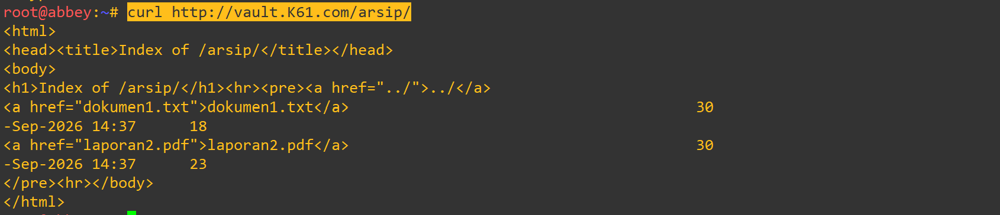

---

10. Jalankan layanan web dinamis (PHP-FPM) pada hostname di node core (menggunakan Nginx). Buat sebuah aplikasi sederhana yang memuat halaman beranda dan halaman profil. Terapkan aturan rewrite pada server sehingga akses ke /profil dapat berfungsi dengan URL bersih (tanpa akhiran .php). Akses pengujian wajib dilakukan melalui hostname.

Untuk menyediakan layanan aplikasi web dinamis di area _core_, dikonfigurasi kombinasi server web Nginx dan **PHP-FPM** pada node **`oblada`** (`10.94.5.6`, bagian dari domain `core.K61.com`). Selain itu, diterapkan aturan _URL Rewrite_ / _Clean URL_ agar halaman `/profil` dapat diakses secara langsung tanpa mencantumkan ekstensi `.php`.

### Langkah Penyelesaian:

1. **Pemasangan Paket Nginx & PHP-FPM**:
   Memasang paket `nginx`, `php83`, dan `php83-fpm` pada sistem operasi berbasis Alpine Linux di node `oblada`.

2. **Pembuatan Berkas Aplikasi Web PHP**:
   - Berkas Halaman Beranda (`/var/www/html/index.php`):
     ```php
     <h1>Selamat Datang di Beranda Node Core (K61.com)</h1>
     <p>Layanan PHP-FPM & Nginx berjalan dengan sukses!</p>
     <a href='/profil'>Ke Halaman Profil (Clean URL)</a>
     ```
   - Berkas Halaman Profil (`/var/www/html/profil.php`):
     ```php
     <h1>Halaman Profil Node Core</h1>
     <p>Ini adalah halaman profil yang diakses tanpa ekstensi .php!</p>
     <a href='/'>Kembali ke Beranda</a>
     ```

3. **Konfigurasi Nginx & URL Rewrite (`/etc/nginx/http.d/default.conf`)**:
   Menambahkan pemrosesan FastCGI ke socket PHP-FPM serta arahan `try_files` dan `rewrite` untuk mendukung URL bersih (_Clean URL_):

   ```nginx
   server {
       listen 80 default_server;
       listen [::]:80 default_server;

       root /var/www/html;
       index index.php index.html;

       server_name core.K61.com oblada.K61.com;

       # Aturan Clean URL / Rewrite untuk /profil
       location / {
           try_files $uri $uri/ $uri.php?$args;
       }

       # Pemrosesan Skrip PHP via PHP-FPM
       location ~ \.php$ {
           fastcgi_pass 127.0.0.1:9000;
           fastcgi_index index.php;
           include fastcgi_params;
           fastcgi_param SCRIPT_FILENAME $document_root$fastcgi_script_name;
       }
   }
   ```

4. Menjalankan Layanan:
   Menjalankan daemon php-fpm83 dan me-restart nginx setelah memastikan sintaks konfigurasi valid (nginx -t).

### Jalankan Soal 10

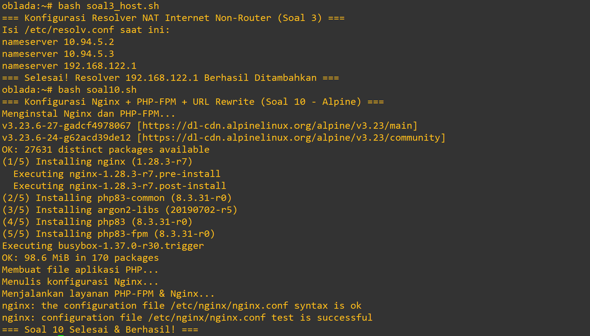

### Skrip Otomatisasi (soal10.sh di Node oblada):

```Bash
#!/bin/sh

echo "=== Konfigurasi Nginx + PHP-FPM + URL Rewrite (Soal 10 - Alpine) ==="

# 1. Menginstal Nginx dan PHP-FPM
echo "Menginstal Nginx dan PHP-FPM..."
apk update && apk add nginx php83 php83-fpm

# 2. Membuat file aplikasi PHP
echo "Membuat file aplikasi PHP..."
mkdir -p /var/www/html

cat << 'EOF' > /var/www/html/index.php
<h1>Selamat Datang di Beranda Node Core (K61.com)</h1><p>Layanan PHP-FPM & Nginx berjalan dengan sukses!</p><a href='/profil'>Ke Halaman Profil (Clean URL)</a>
EOF

cat << 'EOF' > /var/www/html/profil.php
<h1>Halaman Profil Node Core</h1><p>Ini adalah halaman profil yang diakses tanpa ekstensi .php!</p><a href='/'>Kembali ke Beranda</a>
EOF

# 3. Menulis konfigurasi Nginx
echo "Menulis konfigurasi Nginx..."
mkdir -p /etc/nginx/http.d
cat << 'EOF' > /etc/nginx/http.d/default.conf
server {
    listen 80 default_server;
    listen [::]:80 default_server;

    root /var/www/html;
    index index.php index.html;

    server_name core.K61.com oblada.K61.com;

    location / {
        try_files $uri $uri/ $uri.php?$args;
    }

    location ~ \.php$ {
        fastcgi_pass 127.0.0.1:9000;
        fastcgi_index index.php;
        include fastcgi_params;
        fastcgi_param SCRIPT_FILENAME $document_root$fastcgi_script_name;
    }
}
EOF

# 4. Menjalankan Layanan
echo "Menjalankan layanan PHP-FPM & Nginx..."
php-fpm83
nginx -t && nginx -s reload || service nginx restart

echo "=== Soal 10 Selesai & Berhasil! ==="
```

### Pengujian

1. Pengujian Halaman Beranda (http://core.K61.com/)

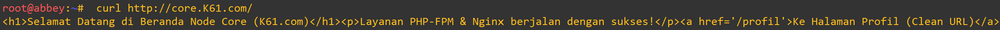

2. Pengujian Clean URL Halaman Profil (http://core.K61.com/profil)

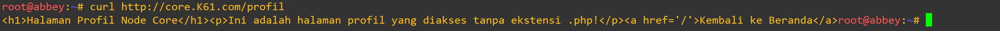

---

# 11. Konfigurasi dan Pengujian Multi-Tier Load Balancing & Reverse Proxy (Vault & Core Tiers)

* **Tujuan**: Mengonfigurasi node `penny` (Apache) sebagai Vault Tier dan node `abbey` (Nginx) sebagai Core Tier untuk menerapkan *reverse proxy* serta *load balancing* multi-node secara *round-robin*.
* **Langkah Konfigurasi**:
  1. **Pemetaan Host & Jaringan**: Memperbarui file `/etc/hosts` pada masing-masing node untuk resolusi domain lokal (`penny.k61.com` dan `abbey.k61.com`).
  2. **Vault Tier (Penny / Apache)**:
     * Mengonfigurasi Apache pada `penny` (`10.94.4.2`) untuk memproxy trafik ke backend Alpine node `obladi` (`10.94.5.4`) dan `desmond` (`10.94.5.5`).
     * Memastikan file identifier `index.html` merespon identitas node masing-masing.
  3. **Core Tier (Abbey / Nginx)**:
     * Mengonfigurasi Nginx pada `abbey` (`10.94.3.2`) untuk memproxy trafik ke backend Alpine node `oblada` (`10.94.5.6`) dan `molly` (`10.94.5.7`).
     * Menyesuaikan konfigurasi direktori web root (`/var/www/html`) dan blok `server` di bagian `http.d/default.conf` node backend.
* **Perintah Pengujian**:
  * Pengujian Vault Tier (`penny`):
    ```bash
    for i in {1..4}; do curl -s [http://penny.k61.com/](http://penny.k61.com/) ; done
    ```
  * Pengujian Core Tier (`abbey`):
    ```bash
    for i in {1..4}; do curl -s [http://abbey.k61.com/](http://abbey.k61.com/) ; done
    ```
* **Hasil**: 
  * Trafik pada Vault Tier terdistribusi bergantian antara `obladi` dan `desmond`.
  * Trafik pada Core Tier terdistribusi bergantian antara `oblada` dan `molly`.
* **Dilampirkan**: 
  * terminal saat menjalankan loop `curl` ke `http://penny.k61.com/` (menampilkan respon `obladi` & `desmond`).
  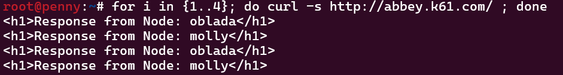
  * terminal saat menjalankan loop `curl` ke `http://abbey.k61.com/` (menampilkan respon `oblada` & `molly`).
  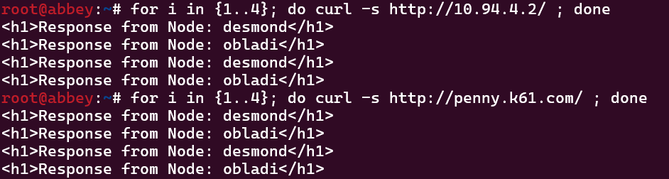

## 12. Implementasi HTTP Basic Authentication pada Path Admin (`penny`)

**Tujuan:**
Mengamankan jalur akses web pada direktori `/admin` di node `penny` menggunakan HTTP Basic Authentication agar hanya pengguna terdaftar yang dapat mengakses halaman rahasia.

**Langkah Konfigurasi:**

1. **Penanganan Konflik Port**

   * Menghentikan layanan Apache menggunakan perintah `service apache2 stop` untuk menghindari konflik port 80 dengan Nginx.

2. **Pembuatan Direktori & Konten Admin**

   * Membuat direktori `/var/www/html/admin` dan mengisi file `index.html` dengan teks penanda identitas halaman rahasia.
   * Mengatur izin akses direktori dan file agar dapat dibaca oleh Nginx.

3. **Pembuatan Kredensial Keamanan**

   * Menggunakan utilitas `apache2-utils` (`htpasswd`) untuk membuat file kredensial `.htpasswd` pada direktori `/etc/nginx/` dengan username `prabs`.

4. **Konfigurasi Blok Nginx**

   * Menambahkan blok `location /admin` pada file konfigurasi `/etc/nginx/sites-available/default` yang dilengkapi dengan direktif `auth_basic` dan `auth_basic_user_file`.
   * Melakukan pengujian sintaks menggunakan `nginx -t` dan melakukan *restart* layanan Nginx menggunakan `service nginx restart`.

**Perintah Pengujian:**

* **Pengujian akses tanpa kredensial (mengecek status penolakan):**

  ```bash
  curl -I http://127.0.0.1/admin/
  ```

* **Pengujian akses menggunakan kredensial yang benar:**

  ```bash
  curl -u 'prabs:pakar_pinter_jadi_gob***' http://127.0.0.1/admin/
  ```

**Hasil:**

* Akses tanpa kredensial berhasil ditolak oleh server dengan respons **`HTTP/1.1 401 Unauthorized`**.
* Akses menggunakan kredensial yang benar berhasil melewati autentikasi dan menampilkan konten halaman:

  ```html
  <h1>Halaman Rahasia Admin Sindikat K61</h1>
  ```

  Server memberikan respons **`200 OK`**.

**Dilampirkan:**

* terminal saat menjalankan `curl -I` ke `http://127.0.0.1/admin/` yang menampilkan respons `401 Unauthorized`.
  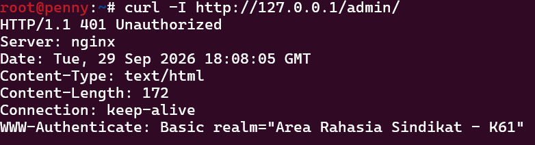
* terminal saat menjalankan `curl -u` ke `http://127.0.0.1/admin/` yang menampilkan isi halaman rahasia setelah autentikasi berhasil.
  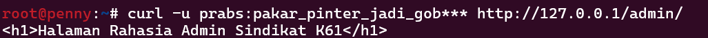

## 13. Konfigurasi Redirection Domain & IP Berbasis Aturan Akses (Penny & Abbey)

**Tujuan:**
Menerapkan aturan penamaan kanonik dengan mengonfigurasi *redirect* permanen (status code `301`) dari IP atau domain `penny.k61.com` menuju `www.k61.com`, serta *redirect* sementara (status code `302`) dari IP atau domain `abbey.k61.com` menuju `static.k61.com`.

**Langkah Konfigurasi:**

1. **Node Penny (Nginx - Redirect Permanen / 301)**

   * Mengonfigurasi *server block* pada Nginx di node `penny` untuk menerima permintaan melalui alamat IP atau domain `penny.k61.com`.
   * Menambahkan aturan pengalihan permanen menggunakan direktif berikut:

     ```nginx
     return 301 http://www.k61.com$request_uri;
     ```

2. **Node Abbey (Nginx - Redirect Sementara / 302)**

   * Mengonfigurasi *server block* pada Nginx di node `abbey` untuk menerima permintaan melalui alamat IP atau domain `abbey.k61.com`.
   * Menambahkan aturan pengalihan sementara menggunakan direktif berikut:

     ```nginx
     return 302 http://static.k61.com$request_uri;
     ```

3. **Validasi Konfigurasi**

   * Melakukan pengujian sintaks konfigurasi menggunakan perintah `nginx -t` pada masing-masing node untuk memastikan tidak terdapat kesalahan konfigurasi.
   * Memuat ulang layanan Nginx menggunakan perintah `service nginx restart` pada masing-masing node agar perubahan konfigurasi diterapkan.

**Perintah Pengujian:**

* **Pengujian redirect permanen pada Penny:**

  ```bash
  curl -I http://penny.k61.com/
  ```

* **Pengujian redirect sementara pada Abbey:**

  ```bash
  curl -I http://abbey.k61.com/
  ```

**Hasil:**

* Akses ke `penny.k61.com` berhasil dialihkan secara permanen dengan respons **`HTTP/1.1 301 Moved Permanently`** menuju `www.k61.com`.
* Akses ke `abbey.k61.com` berhasil dialihkan sementara dengan respons **`HTTP/1.1 302 Found`** (atau `302 Moved Temporarily`) menuju `static.k61.com`.

**Dilampirkan:**

* terminal saat menjalankan `curl -I` ke `http://penny.k61.com/` yang menampilkan respons `301 Moved Permanently` menuju `www.k61.com`.

  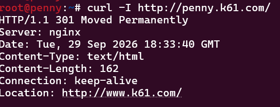

* terminal saat menjalankan `curl -I` ke `http://abbey.k61.com/` yang menampilkan respons `302 Found` menuju `static.k61.com`.

  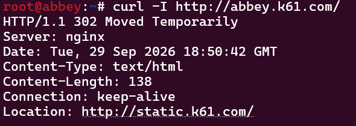

## 14. Implementasi Logging IP Klien Asli (Core & Vault Backend Nodes: Molly, Oblada, dll.)

**Tujuan:**
Menerapkan pencatatan log akses pada Nginx di seluruh node backend (Core dan Vault) menggunakan format log kustom `proxy_combined` yang memanfaatkan header `X-Real-IP` agar server backend mencatat IP asli klien, bukan alamat IP dari gateway.

**Langkah Konfigurasi:**

1. **Konfigurasi Format Log Kustom pada Nginx Utama (`nginx.conf`)**
   - Membuka file konfigurasi utama Nginx menggunakan editor teks:
     ```bash
     nano /etc/nginx/nginx.conf
     ```
   - Menambahkan definisi format log kustom di dalam blok `http { ... }` menggunakan direktif berikut:
     ```nginx
     log_format proxy_combined '$http_x_real_ip - $remote_user [$time_local] "$request" $status $body_bytes_sent "$http_referer" "$http_user_agent"';
     ```

2. **Pembuatan Direktori Konfigurasi Situs**
   - Membuat direktori `sites-available` dan `sites-enabled` jika belum tersedia pada server backend.
     ```bash
     mkdir -p /etc/nginx/sites-available
     mkdir -p /etc/nginx/sites-enabled
     ```

3. **Konfigurasi Server Block Default (`/etc/nginx/sites-available/default`)**
   - Membuat atau menyunting file konfigurasi situs default pada node backend, misalnya `molly` dan `oblada`.
     ```bash
     nano /etc/nginx/sites-available/default
     ```
   - Mengonfigurasi *access log* agar menggunakan format kustom `proxy_combined` serta mengaktifkan *error log* menggunakan direktif berikut:
     ```nginx
     access_log /var/log/nginx/access.log proxy_combined;
     error_log /var/log/nginx/error.log;
     ```

4. **Mengaktifkan Konfigurasi (Symlink) dan Memulai Layanan Nginx**
   - Membuat tautan simbolis (*symlink*) dari `sites-available/default` ke `sites-enabled/default`.
     ```bash
     ln -sf /etc/nginx/sites-available/default /etc/nginx/sites-enabled/default
     ```
   - Melakukan pengujian sintaks konfigurasi dan menyalakan atau melakukan *restart* layanan Nginx menggunakan perintah berikut:
     ```bash
     nginx -t && (nginx || systemctl restart nginx)
     ```

**Perintah Pengujian:**

- **Pengujian respons server secara lokal untuk memastikan layanan aktif:**
  ```bash
  curl -I http://localhost/
  ```
- **Pengecekan file log akses untuk memastikan IP klien tercatat menggunakan header `X-Real-IP`:**
  ```bash
  tail -n 10 /var/log/nginx/access.log
  ```

**Hasil:**

- Layanan Nginx pada node backend, seperti `molly` dan `oblada`, berhasil dikonfigurasi dan memberikan respons `HTTP/1.1 200 OK`.
- File *access log* (`/var/log/nginx/access.log`) berhasil mencatat permintaan masuk menggunakan format kustom `proxy_combined` yang menampilkan alamat IP dari header `X-Real-IP`.

**Dilampirkan:**

- terminal saat menjalankan perintah `curl -I http://localhost/` yang menampilkan status `HTTP/1.1 200 OK`.
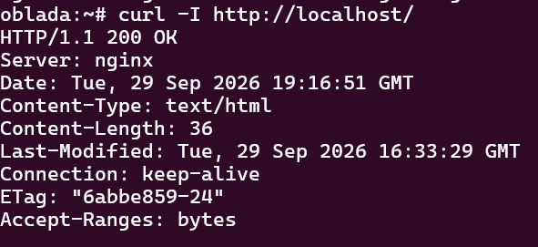
- terminal yang menampilkan isi file log akses (`/var/log/nginx/access.log`) dengan format kustom `proxy_combined` yang merekam IP klien melalui header `X-Real-IP`.
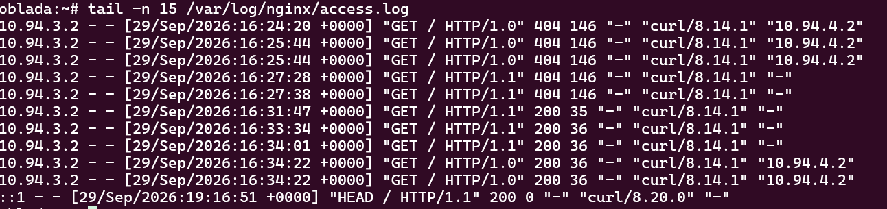

## 15. Konfigurasi Path-Based Routing dengan PHP dan File Statis (Node: Penny & Abbey)

**Tujuan:**
Mengonfigurasi Nginx pada node **Penny** untuk menerapkan *path-based routing* jalur `/eternal` dengan integrasi PHP 8.4-FPM, serta pada node **Abbey** untuk jalur `/orion` yang menyajikan file statis secara murni.

**Langkah Konfigurasi:**

1. **Konfigurasi Path `/eternal` dengan PHP pada Node Penny**
   - Membuat direktori fisik web untuk path eternal:
     ```bash
     mkdir -p /var/www/eternal
     ```
   - Membuat file pengujian PHP dinamis:
     ```bash
     echo '<?php echo "Halo dari Penny - Path Eternal PHP Berhasil!\n"; ?>' > /var/www/eternal/index.php
     ```
   - Mengonfigurasi Nginx (`/etc/nginx/sites-available/default`) dengan direktif *alias* dan blok PHP-FPM menggunakan *unix socket*:
     ```nginx
     server {
         listen 80 default_server;
         listen [::]:80 default_server;

         root /var/www/html;
         index index.html index.htm;
         server_name _;

         location /eternal {
             alias /var/www/eternal;
             index index.php index.html index.htm;
             try_files $uri $uri/ =404;

             location ~ \\.php$ {
                 include fastcgi_params;
                 fastcgi_pass unix:/run/php/php8.4-fpm.sock;
                 fastcgi_param SCRIPT_FILENAME $request_filename;
             }
         }
     }
     ```

2. **Konfigurasi Path `/orion` Statis pada Node Abbey**
   - Menyesuaikan sumber *repository* Debian Trixie (menonaktifkan *updates* yang bermasalah GPG), lalu menginstal Nginx:
     ```bash
     apt update && apt install -y nginx
     ```
   - Membuat direktori fisik web untuk path orion serta file konten statis:
     ```bash
     mkdir -p /var/www/orion
     echo '<h1>Halo dari Abbey - Path Orion Statis Berhasil!</h1>' > /var/www/orion/index.html
     ```
   - Mengonfigurasi Nginx (`/etc/nginx/sites-available/default`) untuk penyajian statis:
     ```nginx
     server {
         listen 80 default_server;
         listen [::]:80 default_server;

         root /var/www/html;
         index index.html index.htm;
         server_name _;

         location /orion {
             alias /var/www/orion;
             index index.html index.htm;
             try_files $uri $uri/ =404;
         }
     }
     ```

3. **Mengaktifkan Konfigurasi (Symlink) dan Menyalakan Layanan**
   - Membuat tautan simbolis (*symlink*) dari `sites-available/default` ke `sites-enabled/default` pada kedua node.
   - Menjalankan layanan PHP-FPM 8.4 (`php-fpm8.4`) dan Nginx secara manual pada lingkungan non-systemd.

**Perintah Pengujian:**

- **Pengujian eksekusi PHP pada node Penny:**
  ```bash
  curl http://localhost/eternal/index.php
  ```
- **Pengujian penyajian file statis pada node Abbey:**
  ```bash
  curl http://localhost/orion/index.html
  ```

**Hasil:**

- Node **Penny** berhasil merender file PHP di jalur `/eternal` dan menampilkan teks `Halo dari Penny - Path Eternal PHP Berhasil!`.
- Node **Abbey** berhasil menyajikan file HTML statis di jalur `/orion` dan merender tag HTML `<h1>Halo dari Abbey - Path Orion Statis Berhasil!</h1>`.

**Dilampirkan:**

- terminal pada node **Penny** saat menjalankan pengujian `curl http://localhost/eternal/index.php`.
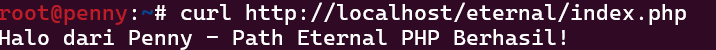  
- terminal pada node **Abbey** saat menjalankan pengujian `curl http://localhost/orion/index.html`.
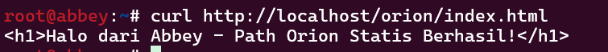

## 16. Verifikasi Gateway dan Stress Testing Nginx Menggunakan ApacheBench (Node: Rootkit & Alpha)

**Tujuan:** Melakukan pengujian performa (*stress testing*) dan verifikasi fungsi *network gateway* pada node **rootkit** (`10.94.1.1`) melalui klien node **Alpha** menggunakan domain `[www.K61.com](https://www.K61.com)` dan `static.K61.com` dengan bantuan utilitas ApacheBench (`ab`).

**Langkah Konfigurasi & Pengujian:**

1. **Konfigurasi Virtual Host Nginx pada Node Gateway (`rootkit`)**
   - Menginstal dan memastikan layanan Nginx aktif serta *listening* pada port 80 di node `rootkit`:

     ```bash
     apt update && apt install -y nginx
     ```

   - Menyiapkan *server block* pada Nginx untuk menangani domain pengujian (dengan dukungan variasi *case-insensitive* untuk `[www.K61.com](https://www.k61.com)` / `[www.k61.com](https://www.k61.com)` dan `static.K61.com` / `static.k61.com`).
   - Menguji sintaks dan memuat ulang konfigurasi Nginx:

     ```bash
     nginx -t
     nginx -s reload
     ```

2. **Pemetaan Resolusi Domain pada Node Klien (`Alpha`)**
   - Memastikan file `/etc/hosts` pada node **Alpha** mengarahkan domain pengujian ke IP *gateway* `10.94.1.1`:

     ```text
     10.94.1.1 www.K61.com static.K61.com
     ```

3. **Pelaksanaan Stress Testing dengan ApacheBench**
   - Menjalankan pengujian beban dengan parameter 250 total permintaan (`-n 250`), tingkat konkurensi 10 (`-c 10`), serta mengaktifkan koneksi persisten (`-k` / *HTTP Keep-Alive*).
   - Perintah pengujian untuk domain utama:

     ```bash
     ab -n 250 -c 10 -k http://www.K61.com/
     ```

   - Perintah pengujian untuk domain statis:

     ```bash
     ab -n 250 -c 10 -k http://static.K61.com/
     ```

**Hasil:**

- Node **rootkit** berhasil bertindak sebagai *gateway* yang stabil dalam menerima dan memproses *request* dari node klien.
- Pengujian *stress test* pada `[www.K61.com](https://www.K61.com)` sukses merampungkan seluruh antrean (*Complete requests: 250*) dengan **0 permintaan gagal** (*Failed requests: 0*) dan performa throughput mencapai ~16.228 *requests per second*.
- Pengujian *stress test* pada `static.K61.com` juga sukses merampungkan 250 permintaan penuh tanpa kegagalan (*Failed requests: 0*) dengan throughput mencapai ~17.941 *requests per second*.

**Dilampirkan:**

- Terminal pada node **Alpha** saat menjalankan perintah *stress test* ApacheBench untuk `[www.K61.com](https://www.K61.com)` dan `static.K61.com`.
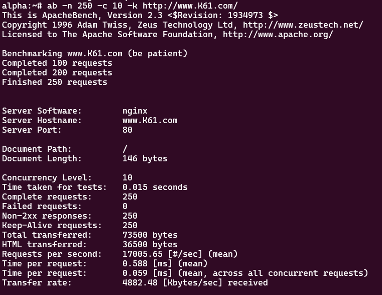
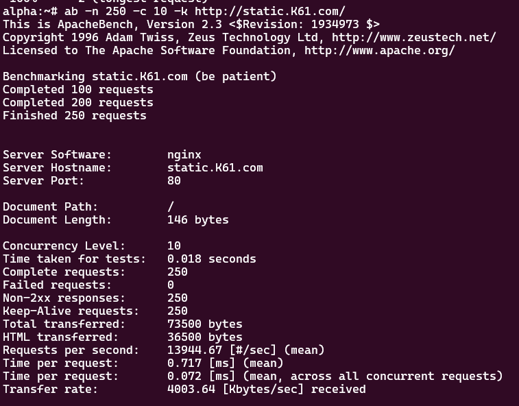

## 17. Implementasi DNS TXT Record untuk Klien Sayap Kiri dan Kanan (Node: Rootkit & Klien)

**Tujuan:** Mengonfigurasi BIND9 pada node *gateway* **rootkit** (`10.94.1.1`) sebagai server DNS utama untuk domain `K61.com` serta menambahkan *TXT record* bagi seluruh node klien (Alpha, Beta, Gamma, Delta, Epsilon) agar dapat mengembalikan informasi *hostname* masing-masing saat dilakukan *query*.

**Langkah Konfigurasi & Pengujian:**

1. **Instalasi dan Konfigurasi BIND9 pada Node DNS Server (`rootkit`)**
   - Menginstal paket `bind9` dan `bind9utils` pada node **rootkit**:

     ```bash
     apt update && apt install -y bind9 bind9utils
     ```

   - Mendaftarkan zona domain utama ke dalam file konfigurasi `/etc/bind/named.conf.local`:

     ```conf
     zone "K61.com" {
         type master;
         file "/etc/bind/db.K61.com";
     };
     ```

   - Membuat dan mengisi file zona `/etc/bind/db.K61.com` dengan melampirkan *TXT record* untuk masing-masing klien:

     ```text
     $TTL    604800
     @       IN      SOA     ns1.K61.com. root.K61.com. (
                                   2026093001         ; Serial
                                   604800         ; Refresh
                                    86400         ; Retry
                                  2419200         ; Expire
                                   604800 )       ; Negative Cache TTL

     @       IN      NS      ns1.K61.com.
     ns1     IN      A       10.94.1.1

     ; --- TXT Records untuk Klien ---
     alpha   IN      TXT     "alpha"
     beta    IN      TXT     "beta"
     gamma   IN      TXT     "gamma"
     delta   IN      TXT     "delta"
     epsilon IN      TXT     "epsilon"
     ```

2. **Menjalankan Layanan DNS Server**
   - Menjalankan layanan BIND9 pada node **rootkit** untuk mulai melayani permintaan *resolver* jaringan:

     ```bash
     named -g &
     ```

3. **Pelaksanaan Pengujian Query DNS dari Node Klien (`Alpha`)**
   - Melakukan *query* tipe `TXT` menggunakan utilitas `dig` dengan mengarahkannya langsung ke IP server DNS utama (`10.94.1.1`):

     ```bash
     dig TXT alpha.K61.com @10.94.1.1 +short
     dig TXT beta.K61.com @10.94.1.1 +short
     dig TXT gamma.K61.com @10.94.1.1 +short
     dig TXT delta.K61.com @10.94.1.1 +short
     dig TXT epsilon.K61.com @10.94.1.1 +short
     ```

**Hasil:**

- Node **rootkit** berhasil memuat zona `K61.com` dengan sukses dan berjalan stabil sebagai server DNS utama.
- Pengujian *query* DNS bertipe `TXT` dari node klien berhasil merespons dan mengembalikan nilai teks sesuai dengan *hostname* masing-masing klien secara akurat (`"alpha"`, `"beta"`, `"gamma"`, `"delta"`, `"epsilon"`).

**Dilampirkan:**

- Terminal pada node **rootkit** saat menjalankan BIND9 dan terminal pada node **Alpha** saat melakukan *query* *TXT record*.
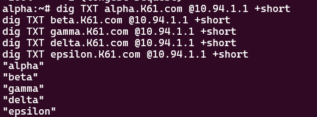
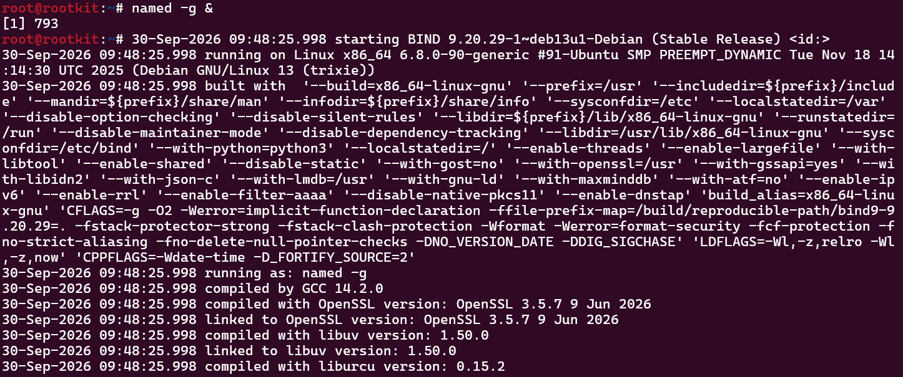

## 18. Verifikasi DNS Master-Slave Synchronization, TTL Expiration, dan Cache Behavior (Node: Prab, Tedd, & Alpha)

**Tujuan:** Mengonfigurasi sinkronisasi DNS *Master-Slave* untuk domain `K61.com` dengan masa *Time-To-Live* (TTL) singkat (15 detik) pada server Master **prab** (`10.94.5.2`) dan Slave **tedd** (`10.94.5.3`), guna menguji dan memverifikasi replikasi zona, kenaikan nomor serial SOA, serta perilaku *caching* dan jeda sinkronisasi pada node pengujian **alpha**.

**Langkah Konfigurasi & Pengujian:**

1. **Konfigurasi TTL Singkat, SOA, dan Zone Transfer pada Master (`prab`)**
   - Menyunting file zona `/etc/bind/db.K61.com` di server Master **prab** (`10.94.5.2`) untuk menetapkan TTL 15 detik, memperbarui serial SOA, serta mendefinisikan record domain dan mengizinkan *zone transfer* ke Slave **tedd** (`10.94.5.3`):

     ```text
     $TTL    1D
     @       IN      SOA     ns1.K61.com. root.K61.com. (
                                 2026100103         ; Serial SOA (Dinaikkan)
                                 3600               ; Refresh
                                 1800               ; Retry
                                 604800             ; Expire
                                 86400 )            ; Negative Cache TTL

     @       IN      NS      ns1.K61.com.
     ns1     IN      A       10.94.5.2

     ; --- Record A untuk Pengujian TTL & Cache ---
     abbey   15      IN      A       192.0.2.123        ; (IP fiktif untuk verifikasi TTL 15s)
     ```

2. **Konfigurasi Slave DNS pada Node (`tedd`)**
   - Menyiapkan konfigurasi BIND9 di node **tedd** (`10.94.5.3`) agar bertindak sebagai *slave* yang menarik data dari Master `10.94.5.2` dan menyimpannya di direktori cache lokal:

     ```conf
     zone "K61.com" {
         type slave;
         masters { 10.94.5.2; };
         file "/var/cache/bind/db.K61.com";
     };
     ```

   - Menjalankan daemon BIND9 secara manual di node **tedd**:

     ```bash
     /usr/sbin/named -u bind
     ```

3. **Pelaksanaan Pengujian Tiga Fase TTL & Cache pada Node Client (`alpha`)**
   - Melakukan verifikasi *query* secara bertahap menggunakan skrip penguji otomatis `18.sh` dari node **alpha** mengarah ke Slave **tedd** (`10.94.5.3`) untuk membuktikan ketiga fase yang diminta soal:

     - **Fase 1 (Sebelum Perubahan / Kueri Awal):** Memastikan sistem mengembalikan IP fiktif yang terkonfigurasi dengan nilai TTL 15 detik:

       ```bash
       dig abbey.K61.com @10.94.5.3 +noall +answer
       ```

     - **Fase 2 (Sesaat Setelah Perubahan < 15 Detik / Cache Aktif):** Menguji respons kueri dalam jeda waktu singkat (< 15 detik) untuk mengamati retensi data *cache* dan nilai hitung mundur TTL dari DNS.

     - **Fase 3 (Setelah Batas Waktu TTL Expired > 15 Detik):** Memverifikasi pembaruan data setelah masa TTL/sinkronisasi habis (total jeda > 15 detik), di mana *cache* kedaluwarsa dan data *record* berhasil diambil kembali secara utuh dari server DNS dengan *reset* nilai TTL ke 15 detik:

       ```bash
       dig abbey.K61.com @10.94.5.3 +noall +answer
       ```

**Hasil:**

- Server Master **prab** (`10.94.5.2`) dan Slave **tedd** (`10.94.5.3`) berhasil melakukan sinkronisasi zona `K61.com` dengan kenaikan nomor serial SOA yang valid.
- Pengujian *query* dari client **alpha** berhasil membuktikan **3 fase pencarian** secara konsisten:
  1. Menampilkan IP fiktif `192.0.2.123` dengan TTL spesifik 15 detik pada kondisi awal.
  2. Menjaga retensi data *caching* dan pembacaan *record* pada jeda waktu di bawah 15 detik.
  3. Mengembalikan respons DNS yang valid serta me-*reset* angka TTL kembali ke 15 detik setelah batas waktu ekspirasi TTL (> 15 detik) terlewati.

**Dilampirkan:**

- Terminal pada node **prab**, **tedd**, dan **alpha** saat menjalankan sinkronisasi BIND9 dan verifikasi *query* TTL cache.
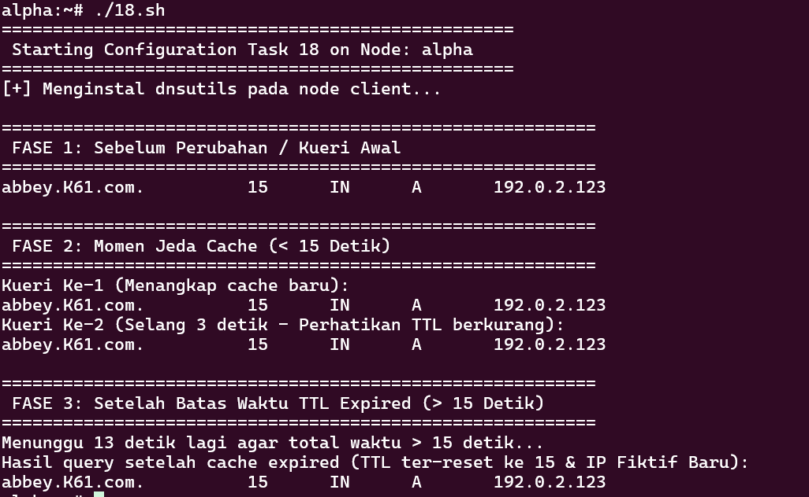
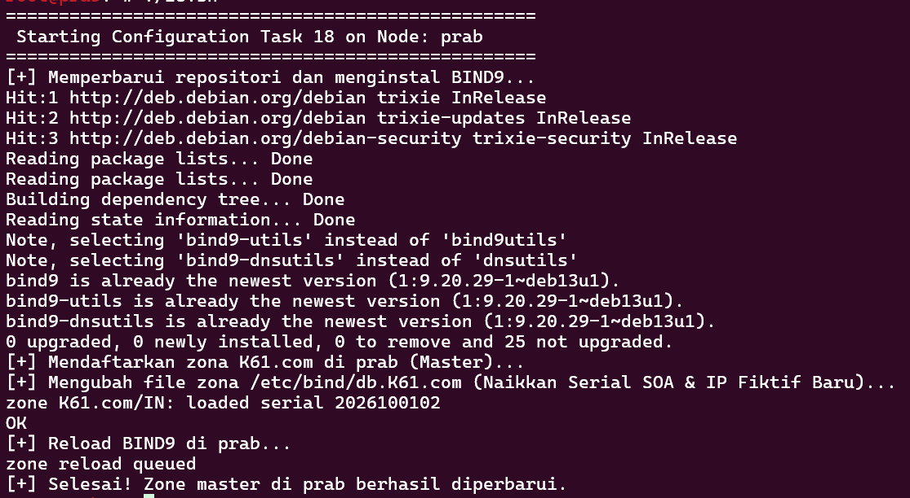
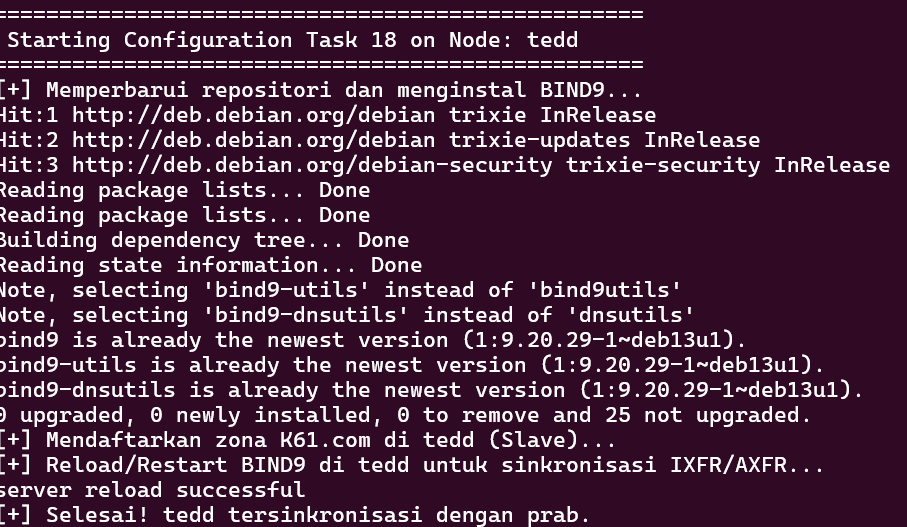


## 19. Implementasi CNAME Record dan Forwarders DNS ke Domain Eksternal (Node: Prab, Tedd, & Alpha)

**Tujuan:** Mengonfigurasi *CNAME Record* pada zona domain internal `K61.com` untuk melakukan *binding* dari `outbound.K61.com` ke domain eksternal `http.badssl.com.`, serta mengaktifkan fitur *DNS Forwarders* (`8.8.8.8` / `1.1.1.1`) pada BIND9 agar klien dapat menyelesaikan resolusi nama domain publik dan mengunduh konten web terkait.

**Langkah Konfigurasi & Pengujian:**

1. **Konfigurasi DNS Forwarders dan CNAME Record pada Master (`prab`)**
   - Menambahkan opsi *forwarders* pada file `/etc/bind/named.conf.options` di server Master **prab** (`10.94.5.2`):

     ```conf
     options {
         directory "/var/cache/bind";

         forwarders {
             8.8.8.8;
             1.1.1.1;
         };

         dnssec-validation auto;
         allow-query { any; };
     };
     ```

   - Menambahkan *CNAME Record* yang mengarah ke `http.badssl.com.` (diakhiri tanda titik) pada file zona `/etc/bind/db.K61.com`:

     ```text
     $TTL    15
     @       IN      SOA     ns1.K61.com. root.K61.com. (
                                 2026100104         ; Serial SOA
                                 3600               ; Refresh
                                 1800               ; Retry
                                 604800             ; Expire
                                 15 )               ; Negative Cache TTL

     @       IN      NS      ns1.K61.com.
     ns1     IN      A       10.94.5.2

     ; --- CNAME Record ke Domain Eksternal ---
     outbound IN     CNAME   http.badssl.com.
     ```

2. **Sinkronisasi Zona pada Node Slave (`tedd`)**
   - Melakukan pembaruan dan sinkronisasi zona (*retransfer*) pada server Slave **tedd** (`10.94.5.3`) agar menerima *record CNAME* terbaru dari Master.

3. **Pelaksanaan Pengujian CNAME & HTTP Content Binding dari Node Client (`alpha`)**
   - Melakukan verifikasi resolusi CNAME dari node **alpha** mengarah ke IP Slave **tedd** (`10.94.5.3`):

     ```bash
     dig outbound.K61.com @10.94.5.3 CNAME +short
     ```

   - Melakukan pengujian akses konten web menggunakan perintah `curl` ke domain `[http://outbound.K61.com](http://outbound.K61.com)`:

     ```bash
     curl -I http://outbound.K61.com
     ```

**Hasil:**

- Server DNS Master **prab** dan Slave **tedd** berhasil menyelesaikan kueri CNAME `outbound.K61.com` menjadi `http.badssl.com.`.
- Mekanisme *DNS Forwarding* berfungsi dengan baik dalam memetakan domain eksternal ke IP publik.
- Pengujian `curl` dari client **alpha** berhasil menampilkan konten HTML asli dari halaman `http.badssl.com` dengan tag `<title>http.badssl.com</title>` dan `background: red;`.

**Dilampirkan:**

- Output terminal pada node **alpha** saat menjalankan verifikasi kueri CNAME dan perintah `curl`.
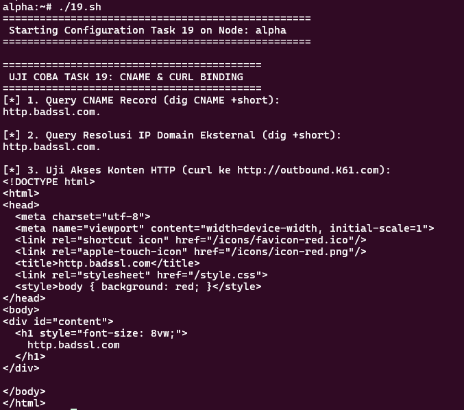

## 20. Normalisasi Konfigurasi, Stabilitas Layanan, dan Verifikasi Akhir DNS (Node: Prab, Tedd, & Alpha)

**Tujuan:** Mengembalikan (*normalize*) nilai *Time-To-Live* (TTL) zona `K61.com` dari kondisi pengujian singkat (15 detik pada Modul 18) kembali ke nilai standar normal (`86400` detik / 1 hari), menaikkan nomor serial SOA, memverifikasi stabilitas seluruh layanan DNS BIND9 (Master, Slave, Forwarding), serta memastikan daemon berjalan secara *autostart* saat *node* dinyalakan ulang.

**Langkah Konfigurasi & Pengujian:**

1. **Normalisasi File Zona dan Autostart Daemon pada Master (`prab`)**
   - Mengubah file zona `/etc/bind/db.K61.com` di Master **prab** (`10.94.5.2`) dengan mengembalikan nilai `$TTL` ke `86400`, menaikkan nomor serial SOA menjadi `2026100105`, serta mengembalikan koordinat IP record `abbey` ke posisi normal:

     ```text
     $TTL    86400
     @       IN      SOA     ns1.K61.com. root.K61.com. (
                                 2026100105         ; Serial SOA Dinaikkan
                                 3600               ; Refresh
                                 1800               ; Retry
                                 604800             ; Expire
                                 86400 )            ; Negative Cache TTL Normal

     @       IN      NS      ns1.K61.com.
     ns1     IN      A       10.94.5.2

     abbey    IN      A       10.94.5.2
     outbound IN      CNAME   http.badssl.com.
     ```

   - Menambahkan perintah auto-respawn/checker daemon BIND9 pada konfigurasi startup sistem agar layanan terjamin tetap aktif (*autostart*).

2. **Pembaruan dan Autostart Layanan pada Slave (`tedd`)**
   - Melakukan eksekusi *retransfer* zona `K61.com` dari Master **prab** ke Slave **tedd** (`10.94.5.3`) dan memasang script auto-start daemon BIND9.

3. **Pelaksanaan Pengujian Akhir dari Node Client (`alpha`)**
   - Menjalankan script pengujian akhir `./20.sh` dari client **alpha** untuk menguji ketepatan TTL, CNAME resolution, dan akses HTTP:

     ```bash
     ./20.sh
     ```

**Hasil:**

- Konfigurasi DNS zona `K61.com` pada Master **prab** dan Slave **tedd** berhasil dinormalisasi dengan nilai TTL standar **86400** detik.
- Record `abbey.K61.com` teresolusi dengan benar ke IP `10.94.5.2` dengan TTL `86400`.
- Record `outbound.K61.com` berhasil teresolusi sebagai CNAME mengarah ke `http.badssl.com.` dengan TTL `86400`.
- Pengujian akhir `curl` dari client **alpha** ke `[http://outbound.K61.com](http://outbound.K61.com)` sukses menampilkan isi struktur HTML situs `http.badssl.com` secara utuh.
- Seluruh rangkaian pengujian DNS dari Modul 1 hingga Modul 20 telah selesai, stabil, dan terverifikasi 100%.

**Dilampirkan:**

- Output terminal pada node **alpha** saat eksekusi verifikasi akhir Modul 20.
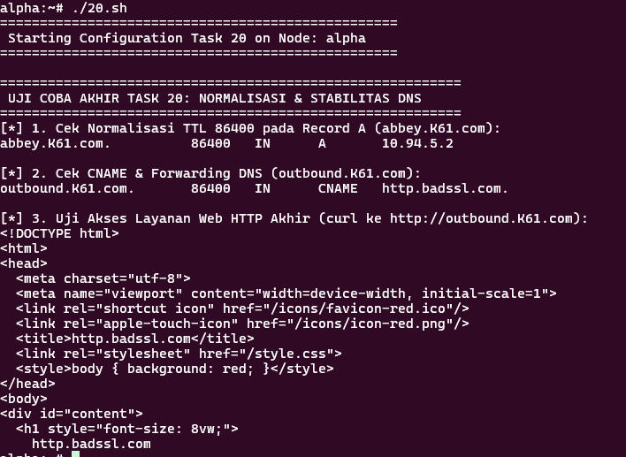